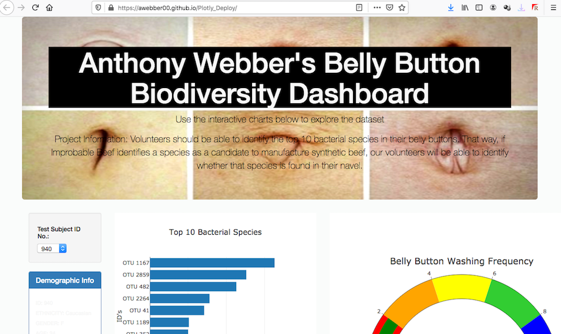
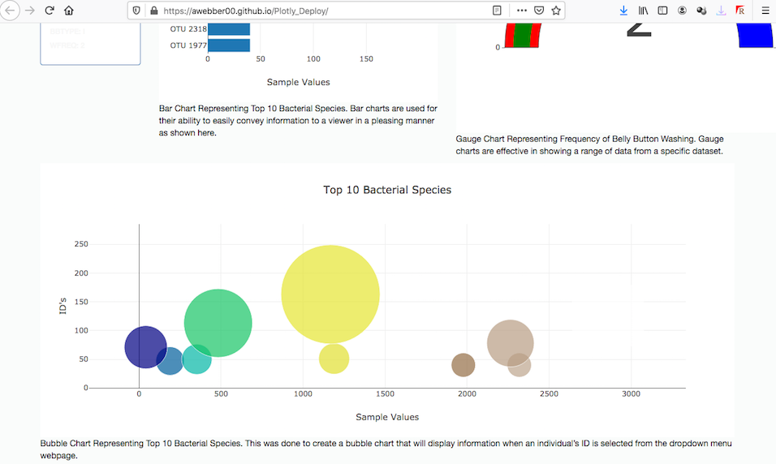

# Plotly_Deploy (Bellybutton Diversity)

## Project Overview
Finalizing a dashboard for a medical study. This project focuses on the visualization of the bacterial data for each volunteer in a specific study. Our volunteers will be able to identify the top 10 bacterial species in their belly buttons. That way, if Improbable Beef identifies a species as a candidate to manufacture synthetic beef, our volunteers will be able to identify whether that species is found in their navel.

## Resources  
- **Data Source:** [index.html](/index.html), [samples.json](/samples.json), [plots.js](/plots.js) 
- **Software:** VS Code, Web browser, Command-line interface, GitHub

## Languages 
- **Javascript**
- **HTML**
- **CSS**

## Poject Objectives  
- Create and display charts on a HTML based webpage to visualize and convey our data to viewers and study participants.
- Use functional programming in JavaScript to manipulate data.
- Use interactivity to enhance visualizations.
- Deployment of interactive chart to GitHub Pages. 
- How to parse data in JSON format.
- How to use D3.json() to fetch external data.

## Challenge Objectives  
The goals of this challenge are for us to:
- Create a bar chart of the top ten bacterial species in a volunteer’s navel. Use JavaScript to select only the most populous species.
- Create a bubble chart to visualize the relative frequency of all the bacterial species found in a volunteer’s navel.
- Customize the Dashboard. 

## Customizations
- Adding an image to the jumbotron. 
- Adding more information about the project as a paragraph on the page under the page title.

## Customizations
 Adding paragraphs next to each chart.
 

## Live Demo
View a [Live Demo](https://awebber00.github.io/Plotly_Deploy/) of Plotly Deploy
